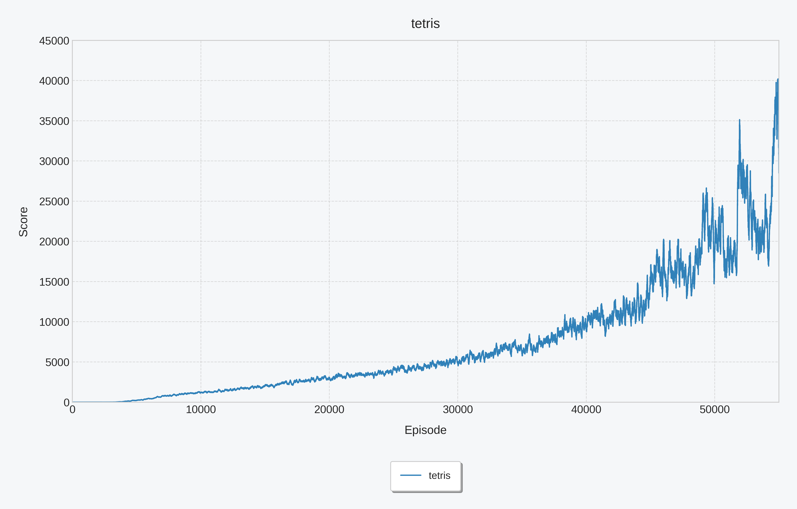

# MystRL

MystRL is a simple Python implementation of reinforcement learning from scratch.

  

### Install

pip install -r requirements.txt

### DQN

#### Snake 

Snake is a fundamentally simple yet thrilling challenge where players guide a continuously moving line across a grid. The objective is to navigate the snake, using directional controls to collect food items like pellets or apples, each consumed piece causing the snake to grow longer. Success requires quick reflexes and careful planning, as the primary danger comes from the snake itself: colliding with any part of its own ever-lengthening body instantly ends the game. This creates an escalating challenge, where the very act of growing and progressing makes maneuvering in the confined space increasingly perilous.

The reward function can be written as:
$$
r(s,a) = 
\begin{cases}
  1 & \text{eat food} \\
  -15 & \text{dead} \\
  0 & \text{otherwise} \\
\end{cases}
$$
The **moving average reward curve (over a sliding window of 100 games)** during training is visualized as follows:

After training, the test results are as follows (conducted on 500 games):

| Total Games | Board Size | Average Score | Success Rate    |
| ----------- | ---------- | ------------- | --------------- |
| 500         | 15 x 8     | 90.97         | 40.4% (202/500) |

##### How To Test

python game_snake.py --mode test --min_eps -1 --model_path model/snake/episode-100000/model_weights --render_mode gui --speed 10

##### How To Train 

python game_snake.py --mode train --device cuda --task_name snake --save_path model/snake --min_eps 0.001 --lr 2e-4 --min_lr 1e-5 --total_decay_episodes 20000 --batch_size 16 --save_every_episodes 2000 --decay_rate 200000 --min_train_buffer_size 100000 --buffer_size 10000000 --n_last_frames 4 --target_update_frequency 10000  --lr_scheduler cosine

#### 2048

2048 is a deceptively simple yet compelling puzzle game played on a 4x4 grid. Players slide numbered tiles in any of the four directions, causing matching tiles to merge into a new tile with their combined value. The core objective is to strategically combine doubles to create ever-larger numbers, ultimately aiming to form the elusive 2048 tile before the grid becomes too crowded. Each move introduces a new low-value tile (usually a '2' or '4'), constantly challenging players to balance their progress against the increasingly filled board.

The reward function can be written as:
$$
r(s,a) = 
\begin{cases}
  -100 & \text{invalid move} \\
  \alpha*\sum_{x\in\text{merged tiles}}\log_2(x) + \beta*N_{zeros}& \text{otherwise} \\
\end{cases}
$$
The **moving average reward curve (over a sliding window of 100 games)** during training is visualized as follows:

After training, the test results are as follows (conducted on 500 games):

| Total Games | Average Score | Success Rate(2048 Rate) |
| ----------- | ------------- | ----------------------- |
| 500         | 29630         | 0.63                    |

| 4096 Rate | 2048 Rate | 1024 Rate | 512 Rate | 256 Rate | 128 Rate |
| --------- | --------- | --------- | -------- | -------- | -------- |
| 0.102     | 0.528     | 0.3       | 0.06     | 0.008    | 0.002    |

##### How To Test

python game_2048.py --mode test --min_eps -1 --model_path model/2048/episode-20000/model_weights --render_mode gui

##### How To Train 

python game_2048.py --mode train --device cuda --task_name 2048 --save_path model/2048 --min_eps 0.0005 --lr 1.5e-4 --batch_size 32 --save_every_episodes 1000 --decay_rate 200000 --min_train_buffer_size 100000 --buffer_size 200000 --min_lr 1e-5 --total_decay_episodes 20000 --lr_scheduler cosine

#### Tetris

Most literature on Tetris AI simplifies the piece placement process to address the core challenge of sparse rewards in reinforcement learning. When agents must execute each movement step (e.g., multiple left/right/turn actions) to position a piece, they receive delayed feedback only upon final placement. This creates a severe credit assignment problem—it's impossible to distinguish which intermediate actions truly contributed to a good outcome amid potentially wasteful moves. Consequently, the common compromise allows the agent to select a piece's final valid placement directly, bypassing the intermediate movements. This offers crucial advantages: it eliminates the need to learn trivial motor skills, focuses the AI purely on strategic board evaluation (like setting up scoring opportunities rather than executing them), and drastically reduces the action space while maintaining meaningful decision-making for each placement. This simplification provides immediate feedback linking choices to board states, enabling efficient learning of high-level strategy.
On the contrary, this project enforces AI mastery of precise piece manipulation. We implement Potential-based Reward Shaping, which strategically alleviates sparse rewards by delivering immediate feedback. 

The reward function can be written as:
$$
r(s,a,s') = \phi(s')-\phi(s)+r(s,a)
$$

$$
\phi(s) = -(w_{height}*height+w_{hole}*hole+w_{bumpiness}*bumpiness)
$$

$$
r(s,a) = 
\begin{cases}
  1 & \text{if } clear\_lines =1 \\
  3 & \text{if } clear\_lines =2 \\
  5 & \text{if } clear\_lines =3 \\
  8 & \text{if } clear\_lines =4 \\
  -100 & \text{if } \text{dead}  \\
  0 & \text{otherwise} \\
\end{cases}
$$

The **moving average reward curve (over a sliding window of 100 games)** during training is visualized as follows:

After training, the test results are as follows (conducted on 500 games):

| Total Games | Average Score | Average Clear Lines |
| ----------- | ------------- | ------------------- |
| 500         | 17802         | 162.85              |

##### How To Test

python game_tetris.py --mode test --min_eps -1 --model_path model/tetris/episode-45000/model_weights --render_mode gui --speed 30

##### How To Train 

python game_tetris.py --mode train --device cuda --task_name tetris --save_path model/tetris --min_eps 0.0005 --lr 2e-4 --batch_size 32 --save_every_episodes 1000 --decay_rate 200000 --min_train_buffer_size 100000 --buffer_size 20000000 --target_update_frequency 10000 --lr_scheduler cosine --total_decay_episodes 20000 --min_lr 1e-5 --n_episode 45000

#### **DQN Training Tips** 

1. **Always represent states using sequences of multiple game frames (typically N=4) rather than a single current frame.**
2. **Avoid using excessively large batch sizes (start with 16 as a typical trial value), as this fundamentally differs from supervised training (e.g., image classification).**
3. **Avoid overemphasizing widely-touted advanced techniques (e.g., Double DQN/Dueling DQN/Multi-step DQN, etc.) — begin experimentation with basic DQN implementations.**
4. **If your model exhibits significant performance degradation in later training phases, try learning rate decay at an earlier stage.**

