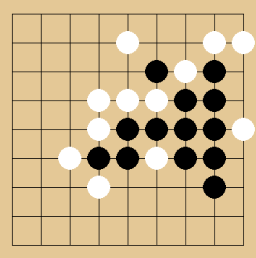
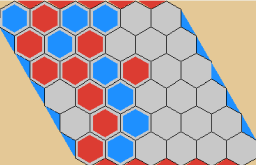

# MystRL

MystRL is a simple Python implementation of reinforcement learning from scratch.

   
   

### Install

pip install -r requirements.txt

### Download Models

All the models can be download at https://drive.google.com/drive/folders/1xYKtd0LPHD4llrtssdLDn2qzlE-4bL-8?usp=sharing

### Hardware Requirements

All models can be tested on a laptop (even without a GPU).  All training was conducted on a single **A800 GPU** with a **30-core CPU** and 180GB of **RAM**.

### DQN

**DQN** (Deep Q-Network) is a reinforcement learning algorithm that uses a deep neural network to make an agent's decisions. Instead of storing all possible states and actions in a traditional Q-table, DQN uses a neural network to estimate the value (Q-value) of each action from a given state, allowing it to handle complex environments like video games.

To make the learning process stable, DQN uses two main techniques:

- Experience Replay: It stores the agent's past experiences (state, action, reward, next state) in a memory buffer and randomly samples from it to train the network. This breaks the correlation between consecutive experiences.
- Target Network: It uses a second, separate network to set the training targets. This "target network" is updated less frequently than the main network, which helps prevent the model from becoming unstable during training.

#### Snake 

Snake is a fundamentally simple yet thrilling challenge where players guide a continuously moving line across a grid. The objective is to navigate the snake, using directional controls to collect food items like pellets or apples, each consumed piece causing the snake to grow longer. Success requires quick reflexes and careful planning, as the primary danger comes from the snake itself: colliding with any part of its own ever-lengthening body instantly ends the game. This creates an escalating challenge, where the very act of growing and progressing makes maneuvering in the confined space increasingly perilous.

The reward function can be written as:

$$
r(s,a) = 
\begin{cases}
  1 & \text{eat food} \\
  -15 & \text{dead} \\
  0 & \text{otherwise} \\
\end{cases}
$$

The **moving average reward curve (over a sliding window of 100 games)** during training is visualized as follows:


After training, the test results are as follows (conducted on 500 games):

| Total Games | Board Size | Average Score | Success Rate    |
| ----------- | ---------- | ------------- | --------------- |
| 500         | 15 x 8     | 90.97         | 40.4% (202/500) |

##### How To Test

python game_snake.py --mode test --min_eps -1 --model_path model/snake/episode-100000/model_weights --render_mode gui --speed 10

Add --device cuda if you have a GPU available.

##### How To Train 

python game_snake.py --mode train --device cuda --task_name snake --save_path model/snake --min_eps 0.001 --lr 2e-4 --min_lr 1e-5 --total_decay_episodes 20000 --batch_size 16 --save_every_episodes 2000 --decay_rate 200000 --min_train_buffer_size 100000 --buffer_size 10000000 --n_last_frames 4 --target_update_frequency 10000  --lr_scheduler cosine

#### 2048

2048 is a deceptively simple yet compelling puzzle game played on a 4x4 grid. Players slide numbered tiles in any of the four directions, causing matching tiles to merge into a new tile with their combined value. The core objective is to strategically combine doubles to create ever-larger numbers, ultimately aiming to form the elusive 2048 tile before the grid becomes too crowded. Each move introduces a new low-value tile (usually a '2' or '4'), constantly challenging players to balance their progress against the increasingly filled board.

The reward function can be written as:

$$
r(s,a) = 
\begin{cases}
  -100 & \text{invalid move} \\
  \alpha*\sum_{x\in\text{merged tiles}}\log_2(x) + \beta*N_{zeros}& \text{otherwise} \\
\end{cases}
$$

The **moving average reward curve (over a sliding window of 100 games)** during training is visualized as follows:


After training, the test results are as follows (conducted on 500 games):

| Total Games | Average Score | Success Rate(>=2048 Rate) |
| ----------- | ------------- | ------------------------- |
| 500         | 29630         | 0.63                      |


##### How To Test

python game_2048.py --mode test --min_eps -1 --model_path model/2048/episode-20000/model_weights --render_mode gui

Add --device cuda if you have a GPU available.

##### How To Train 

python game_2048.py --mode train --device cuda --task_name 2048 --save_path model/2048 --min_eps 0.0005 --lr 1.5e-4 --batch_size 32 --save_every_episodes 1000 --decay_rate 200000 --min_train_buffer_size 100000 --buffer_size 200000 --min_lr 1e-5 --total_decay_episodes 20000 --lr_scheduler cosine

#### Tetris

Most literature on Tetris AI simplifies the piece placement process to address the core challenge of sparse rewards in reinforcement learning. When agents must execute each movement step (e.g., multiple left/right/turn actions) to position a piece, they receive delayed feedback only upon final placement. This creates a severe credit assignment problem—it's impossible to distinguish which intermediate actions truly contributed to a good outcome amid potentially wasteful moves. Consequently, the common compromise allows the agent to select a piece's final valid placement directly, bypassing the intermediate movements. This offers crucial advantages: it eliminates the need to learn trivial motor skills, focuses the AI purely on strategic board evaluation (like setting up scoring opportunities rather than executing them), and drastically reduces the action space while maintaining meaningful decision-making for each placement. This simplification provides immediate feedback linking choices to board states, enabling efficient learning of high-level strategy.
**On the contrary, this project enforces AI mastery of precise piece manipulation. We implement Potential-based Reward Shaping, which strategically alleviates sparse rewards by delivering immediate feedback.** 

The reward function can be written as:

$$
r(s,a,s') = \phi(s')-\phi(s)+r(s,a)
$$

$$
\phi(s) = -(w_{height}*height+w_{hole}*hole+w_{bumpiness}*bumpiness)
$$

$$
r(s,a) = 
\begin{cases}
  1 & \text{if } clear\_{lines} =1 \\
  3 & \text{if } clear\_{lines} =2 \\
  5 & \text{if } clear\_{lines} =3 \\
  8 & \text{if } clear\_{lines} =4 \\
  -100 & \text{if } \text{dead}  \\
  0 & \text{otherwise} \\
\end{cases}
$$

The **moving average reward curve (over a sliding window of 100 games)** during training is visualized as follows:


After training, the test results are as follows (conducted on 1000 games):

| Total Games | Average Score | Average Clear Lines |
| ----------- | ------------- | ------------------- |
| 1000        | 42146         | 383.65              |

##### How To Test

python game_tetris.py --mode test --min_eps -1 --model_path model/tetris/episode-54000/model_weights --render_mode gui --speed 30

Add --device cuda if you have a GPU available.

##### How To Train 

python game_tetris.py --mode train --device cuda --task_name tetris --save_path model/tetris --min_eps 0.0005 --lr 2e-4 --batch_size 32 --save_every_episodes 1000 --decay_rate 200000 --min_train_buffer_size 100000 --buffer_size 20000000 --target_update_frequency 10000 --lr_scheduler cosine --total_decay_episodes 20000 --min_lr 1e-5 --n_episode 55000

#### **DQN Training Tips** 

1. **Always represent states using sequences of multiple game frames (typically N=4) rather than a single current frame.**
2. **Avoid using excessively large batch sizes (start with 16 as a typical trial value), as this fundamentally differs from supervised training (e.g., image classification).**
3. **Avoid overemphasizing widely-touted advanced techniques (e.g., Double DQN/Dueling DQN/Multi-step DQN, etc.) — begin experimentation with basic DQN implementations.**
4. **If your model exhibits significant performance degradation in later training phases, try learning rate decay at an earlier stage.**

### AlphaZero

**AlphaZero** is a reinforcement learning algorithm that masters games like chess, shogi, and Go entirely through **self-play**, without any human knowledge or data. It learns to play by starting from random moves and improving over time by playing millions of games against itself.

The algorithm has three main components:

- A **deep neural network** that is trained to predict the best move to make from a given game state (the policy) and the likely winner of the game (the value).
- **Monte Carlo Tree Search (MCTS)**, an advanced search algorithm that uses the neural network's predictions to explore possible moves and build a game tree, helping the AI decide on the most promising action.
- **Self-play**, the engine of AlphaZero's learning. The algorithm repeatedly plays games against itself. Each game provides new data (game states, chosen moves, and the final winner) to train the neural network, continuously improving its policy and value predictions.

#### Connect4

Connect Four is a two-player game played on a vertical grid. Players take turns dropping colored discs from the top into one of the seven columns. The goal is to be the first to form a horizontal, vertical, or diagonal line of four of one's own discs. The game ends when a player achieves this goal or when the grid is completely filled, resulting in a draw.

##### How To Test

python game_connect4.py --mode test --model_path model/connect4/iteration-399/model_weights

##### How To Train 

python game_connect4.py --task_name connect4 --mode train --device cuda --n_parallel_games 20 --n_process 25 --n_simulations 500 --batch_size 128 --save_path model/connect4 --train_epochs 5 --n_total_games 200000

#### Othello

Othello, or Reversi, is a two-player board game played on an 8x8 grid. Players use identical discs that are light on one side and dark on the other. The game begins with four discs placed in the center of the board. Players take turns placing a disc with their color facing up. A move is only legal if it "flanks" one or more of the opponent's discs, meaning the new disc and another disc of the player's color are at opposite ends of a straight line of the opponent's discs. The flanked discs are then flipped to the player's color. The game ends when neither player can make a legal move, and the player with the most discs of their color on the board wins.

##### How To Test

python game_othello.py --mode test --model_path model/othello/iteration-399/model_weights

##### How To Train 

python game_othello.py --task_name othello --mode train --device cuda --n_parallel_games 20 --n_process 25 --n_simulations 500 --batch_size 128 --save_path model/othello --train_epochs 5 --n_total_games 200000

#### Gomoku

Gomoku, also known as Five in a Row, is an abstract strategy board game. Played with black and white stones on a 15x15 grid, two players take turns placing their stones on an empty intersection. The objective is to be the first to form an unbroken line of five stones of the same color, either horizontally, vertically, or diagonally.

##### How To Test

python game_gomoku.py --mode test --model_path model/gomoku/iteration-39/model_weights

##### How To Train 

python game_gomoku.py --task_name gomoku --mode train --device cuda --n_parallel_games 20 --n_process 25 --n_simulations 500 --batch_size 128 --save_path model/gomoku --train_epochs 5 --n_total_games 20000

### Contact

Email address: yaoxiaoyuan1990@gmail.com.  Or you can add my WeChat:

 

### Cite

```
@misc{mimix,
  title={MystRL},
  author={Xiaoyuan Yao},
  year={2025}
}
```

